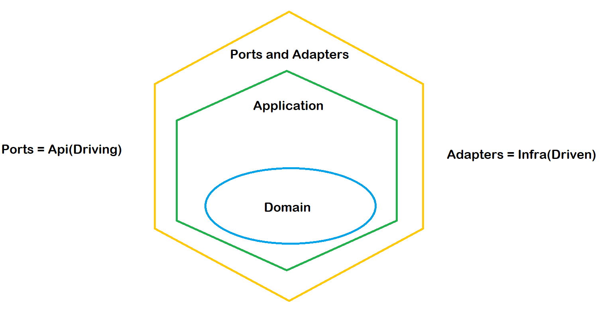

# Hexagonal Architecture
##### _This project is to study the operation of Hexagonal architecture. Put implementation with many projects A.I. For test the integration and utilization the same._



Hexagonal Architecture is a software architecture pattern that separates the business logic of an application from its external infrastructure by creating independent and isolated layers. The core layer of the architecture is the business logic, which is surrounded by layers of user interface, input and output adapters, and data persistence adapters. This approach promotes greater flexibility, testability, and maintainability of the code, allowing changes to the external infrastructure of the application to be made without affecting the business logic..

## Why use Hexagonal Architecture in C# .NET projects?

> Note: Overall, the use of Hexagonal Architecture can result in a more robust, maintainable, and scalable application, which is easier to test and adapt to changing business requirements.

#### In C# .NET projects, using Hexagonal can bring several benefits, such as:

There are several reasons why one might choose to use Hexagonal Architecture in C# .NET projects:

Separation of concerns: Hexagonal Architecture promotes the separation of concerns between the business logic and the infrastructure, resulting in a more modular and maintainable codebase.

Testability: The architecture enables easier unit testing, as the business logic is isolated from the infrastructure, allowing for the creation of mock objects and stubs.

Flexibility: The architecture provides flexibility in the choice of technology for the infrastructure, allowing for easy integration of new technologies or changes to existing ones.

Scalability: The modular design of the architecture makes it easier to scale the application, as new features can be added without affecting the existing codebase.

Maintainability: The architecture promotes a clean and structured codebase, which is easier to understand and maintain over time.

## Prerequisites

- Visual Studio 2022
- .NET Core 6

## Plugins Install Nuget Packages

Microsoft.Extensions.Hosting  Version="7.0.1"

Microsoft.Extensions.Http Version="7.0.0" 

Swashbuckle.AspNetCore Version="6.2.3"

Microsoft.NETCore.App


## Installation

After the run Clear Project, ReBuild Project.

Create account then generate a key to use chatGPT in the link:

https://platform.openai.com/account/api-keys

Your API key. This is required by most endpoints.You can view your xi-api-key using the 'Profile' tab on the website.

https://api.elevenlabs.io/docs#

Run command:

```sh
{
  "Logging": {
    "LogLevel": {
      "Default": "Information",
      "Microsoft.AspNetCore": "Warning"
    }
  },
  "AllowedHosts": "*",
  "OpenaiKey": "YOUR-KEY-OPENAI-HERE",
  "ElevenLabsKey": "YOUR-KEY-ELEVENLABS-HERE"
}
```

## Use

Use Swagger to test this end-points:

For questions and answer:


For questions and answer in speech:


## License

GNU

###### Thanks for reading

